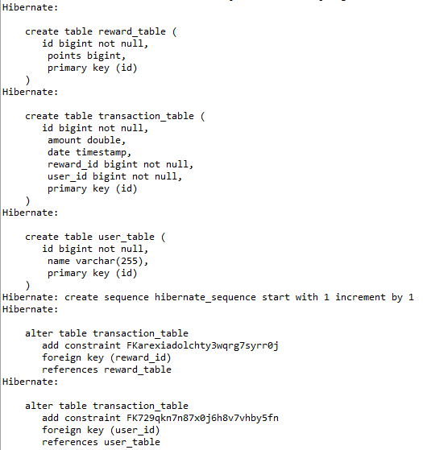

# Monsoon Rewards Programme (monsoon-rewards)

## Summary

This is a application written using Spring Boot, Spring Data JPA. The purpose of this application is to demonstrate the retailer offer as below:
A retailer offers a rewards programme to its customers awarding points based on each recorded purchase as follows: 

1. For every dollar spent over $50 on the transaction, the customer receives one point.
2. In addition, for every dollar spent over $100, the customer receives another point.

For example: for a $120 purchase, the customer receives

```text
(120 - 50) x 1 + (120 - 100) x 1 = 90 points
```

## Technical Insights

### DB Schema:
Below is the screen shot captured to explain how the DB is created when the application starts:





### Add User API:
Below is the screenshot of the ARC execution of Add User API.


**Note:** Add User API should always be executed first, before the transaction API. There should be a valid user present in the system to perform the transaction(s)


### Add Transaction API:
Next, image shows the Add Transaction API.


## Unit Tests

A couple of unit tests have been added just to demonstrate the way the unit test cases are being written. 100% coverage of the code is out of the scope of this assignment.
If you want to run the unit tests as well as the application, please follow the steps below:

1. Clone the repository from https://github.com/saurabh-agrawal-IN/monsoon-rewards.git
2. import the existing Maven project using IDE.
3. Run the Spring boot application.

To run the unit tests:

4. Expand the src/test/java folder
5. Right click on the *Tests.java class file.
6. Select Run as 'JUnit Test'

**Note:** For development purpose the Advanced Rest Client has been used. 

## Steps to Run Program:

1. Got to project directory.
2. Start the Spring boot application - mvn spring-boot:run;
3. Create new user using below:
	URL: http://localhost:8080/monsoon-rewards/v1/users/
	Method: POST
	Payload:
	
		{
			"name": "Saurabh"
		}
4. Create at least 2-3 transaction:
	URL:http://localhost:8080/monsoon-rewards/v1/transactions/
	Method: POST
	Payload:

		{
		  "user": {
		    "name": "Saurabh",
		    "id": "1"
		  },
		  "amount": "3278",
		  "date": "07/14/2022"
		}


